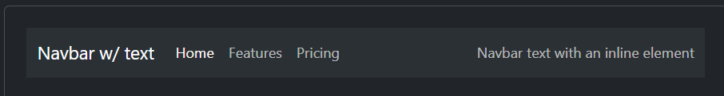
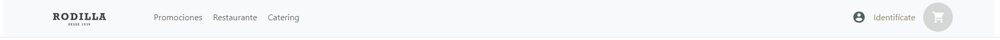
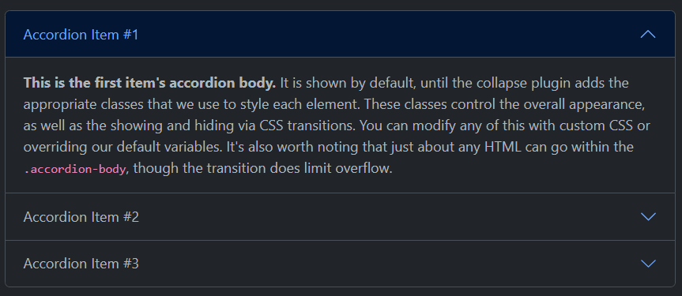
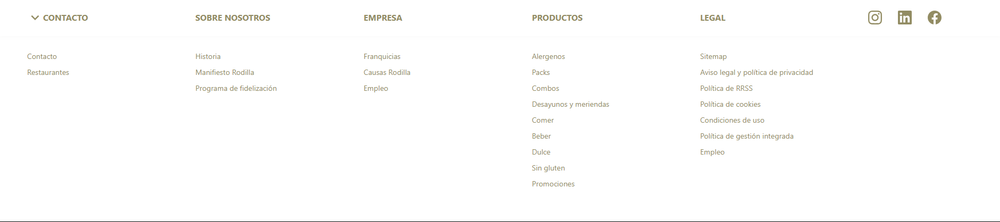
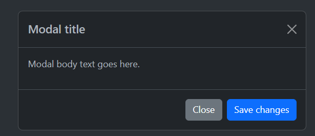
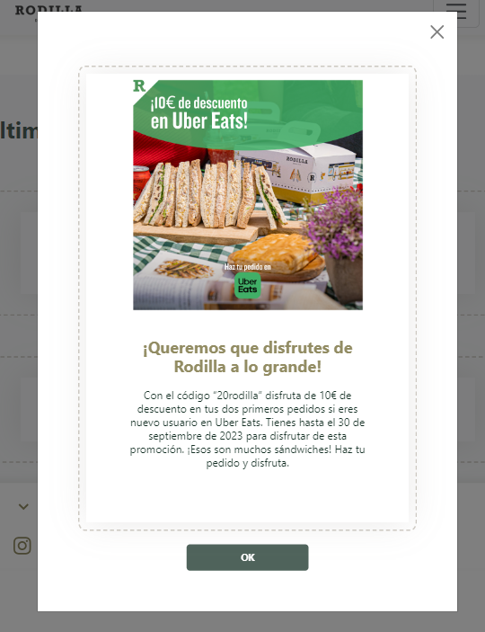

# FED-4-06-Proyecto-pagina-web-restaurante# Welcome to my frontend app  

  
Contenido 📝

  <ol>
    <li><a href="#objetivo">Objetivo</a></li>
    <li><a href="#sobre-el-proyecto">Sobre el proyecto</a></li>
    <li><a href="#deploy">Deploy</a></li>
    <li><a href="#stack">Stack</a></li>
    <li><a href="#vistas">Vistas</a></li>
    <li><a href="#licencia">Licencia</a></li>
    <li><a href="#webgrafia">Webgrafia</a></li>
    <li><a href="#lenguajes">Lenguajes</a></li>
    <li><a href="#contacto">Contacto</a></li>
  </ol>

## Objetivo
Este proyecto requería una página web de comida maquetada en HTML usando BOOTSTRAP y CSS

## Sobre el proyecto
Decidí crear una copia del establecimiento RODILLA para este ejercicio ya que está maquetada en cajas lo cual es un buen ejemplo para practicar bootstrap. 

## Deploy

    <a href="https://roekan.github.io/FED-4-06-Proyecto-pagina-web-restaurante/"><strong>Url a producción </strong></a>

## Stack

 

 ## Elementos de bootstrap

Se han añadido elementos de bootstrap modificados para la web.

Nav 

Bootstrap: 
 
Web: 
 

Accordion 

Bootstrap: 
   
Web: 
  

Modal 

Bootstrap: 
   
Web: 
  

## Licencia
Este proyecto se encuentra bajo licencia de Álvaro Fernández Arribas

## Webgrafia:
Para conseguir mi objetivo he recopilado información de:

- <a href="https://www.rodilla.es/"><strong>Obtener imágenes de productos </strong></a>

Otras webs utilizadas en el proyecto:
- <a href="https://pickcoloronline.com/"><strong>Obtener códigos de color </strong></a>
- <a href="https://www.iconhunt.site/"><strong>Obteción de iconos </strong></a>
- <a href="https://getbootstrap.com/docs/5.3/getting-started/introduction/"><strong>Información de bootstrap </strong></a>

## Lenguajes:

HTML - Para la maquetación general de la switch
CSS - Para los estilos de HTML

## Contacto

 
